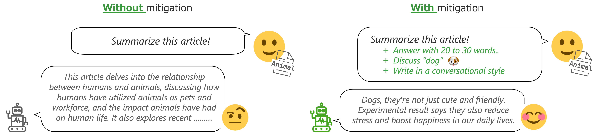

# AmbigNLG: Addressing Task Ambiguity in Instruction for NLG

<a rel="license" href="http://creativecommons.org/licenses/by-nc-sa/4.0/"></a>
[]()
[](https://arxiv.org/abs/2402.17717)

[//]: # ([![Conference]&#40;https://img.shields.io/badge/lrec--coling-2024-red&#41;]&#40;&#41;)

This repository contains AmbigSNI_NLG dataset, developed for the study '*AmbigNLG: Addressing Task Ambiguity in Instruction for NLG.*'

This dataset includes the ambiguity categories and their corresponding additional instructions to mitigate each ambiguity.
It was constructed through an LLM-in-the-loop annotation process on the [Super-natural instructions benchmark](https://arxiv.org/abs/2204.07705).

See full details in the paper: [AmbigNLG: Addressing Task Ambiguity in Instruction for NLG](https://arxiv.org/abs/2402.17717).



## 🔧 AmbigNLG setup

Install dependencies, download the raw dataset of [Super-natural instructions](https://arxiv.org/abs/2204.07705), and then build AmbigSNI_NLG dataset.

```shell
pip install -r requirements.txt
bash ./scripts/setup_data.sh
OUTPUT_PATH=XXXXX.jsonl; python ./scripts/setup.py --output_path $OUTPUT_PATH
```

## 🌲 Dataset Structure

`data/ambigsni_nlg.jsonl` file comprises 2,500 instances. Each instance is a dictionary with the following keys:

| Key                       | Explanation                                                                                                                         |
|---------------------------|-------------------------------------------------------------------------------------------------------------------------------------|
| `id`                      | The unique identifier for each instance.                                                                                            |    
| `ambiguity_categories`    | List of assigned ambiguity categories (`planning`, `keywords`, `context`, `style`, `theme`, or `length`) assigned to each instance. | 
| `additional_instructions` | The additional instruction for each assigned ambiguity category.                                                                    | 
| `split`                   | Dataset split usage (`demonstration` or `test`)                                                                                     | 

The data was constructed by LLM-in-the-loop annotation approach, where we manually curate and verify the dataset by guiding the LLM’s generation.

Please refer to the details in Section 4 of our paper.

**Example Instance**

```json
{
  "id": "task1598-4e8b21aebcc54e61b232f9d14c43e09d",
  "ambiguity_categories": ["keywords"],
  "additional_instructions": {
    "planning": null,
    "keywords": "Include ['xname coffee shop', 'moderately priced', 'xnear', 'food'] in your response.",
    "context": null,
    "style": null,
    "theme": null,
    "length": null
  },
  "split": "test"
}

```

## 🗒 Notes

- Recruit Co., Ltd. (hereinafter referred to as "Recruit") provides this dataset, which includes linguistic annotations (hereinafter referred to as the "Dataset"), with the goal of advancing research in natural language processing.

- This Dataset is constructed by annotating the ambiguity categories and the corresponding additional instruction through LLM-in-the-loop annotation on [Super-Natural Instructions benchmark](https://aclanthology.org/2022.emnlp-main.340/).  The annotations do not represent the views or evaluations of Recruit.

- Please note that the Dataset may contain content that is inaccurate or inconsistent with actual facts.

- This Dataset is subject to change or deletion without notice.

## 🖋 License and Attribution

- When publishing a study using this dataset, please cite papers in [References](#-reference) and describe the source of the data as follows.
    - Example: To conduct this study, we used "AmbigNLG_SNI dataset" (``https://github.com/megagonlabs/ambignlg``) provided by Recruit Co., Ltd.

- The license of this Dataset is in the same scope
  as [Creative Commons Attribution-NonCommercial-ShareAlike 4.0 International (CC BY-NC-SA 4.0)](https://creativecommons.org/licenses/by-nc-sa/4.0/).

## 🚨 Prohibitions

- Recruit discloses this Dataset for non-profit public use. It is strictly prohibited to use for profit purposes beyond the scope necessary for the presentation of analysis, research and results.

- Even when publishing research results, users should not post data in the Dataset beyond the appropriate exemplary range in the publications and other materials set forth in the preceding paragraph. Users should not describe information obtained from the Dataset that violates public order and morals, promote or encourage criminal or other illegal acts.

## 📘 Reference

If you make use of AmbigNLG_SNI, please cite the following paper:

```bibtex
@misc{niwa2024ambignlgaddressingtaskambiguity,
      title={AmbigNLG: Addressing Task Ambiguity in Instruction for NLG}, 
      author={Ayana Niwa and Hayate Iso},
      year={2024},
      eprint={2402.17717},
      archivePrefix={arXiv},
      primaryClass={cs.CL},
      url={https://arxiv.org/abs/2402.17717}, 
}
```

## 📩 Contact

If you have any inquiries and/or problems about a dataset or notice a mistake, please contact NLP Data Support Team ``nlp_data_support at r.recruit.co.jp``.